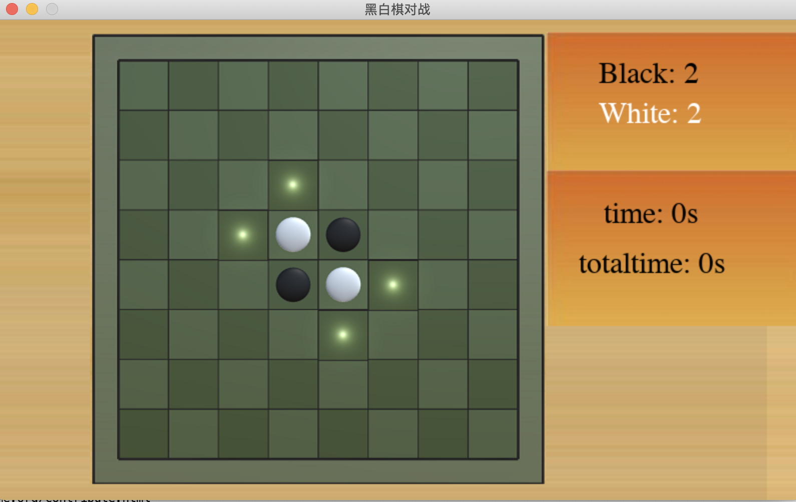

#### 简介
这是一个基于python实现翻转棋游戏，其主要是基于pygame及朴素的蒙特卡洛树搜索的算法所构建的人机对战的游戏。


#### 使用
环境： `python3.6+`

使用pip安装依赖
```
pip install -r requirments.txt
```


运行：

```
python reversi.py
```

参数:
```
  -m MAX_ITERATE, --max_iterate MAX_ITERATE
                        The larger the number of iterations, the more simulations are performed and the closer the simulated sampling results are to the true distribution, but the longer the
                        time consumed
  -c CONSTANT_FACTOR, --constant_factor CONSTANT_FACTOR
                        hyper parameter, constant factor to balance the experience and future expectation

```

1. `MAX_ITERATE`主要控制蒙特卡洛树搜索的构建时模拟的次数，当次数越多搜索树构建越慢，但采样的结果越准确。

2. `CONSTANT_FACTOR`是UCB公式计算时的常数因子，一般保持默认就好。

#### 效果

